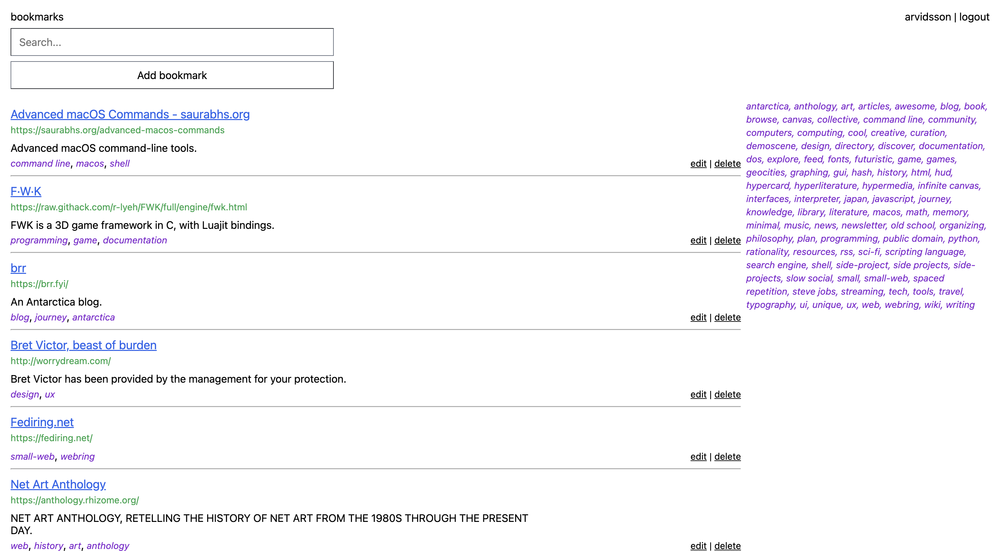

# bookmarks

Web app for managing bookmarks.



## Features

- Add, delete, edit, search bookmarks
- Add bookmarks easily via bookmarklet (prefills information using meta tags)
- Tags

### Bookmarklet

Add a bookmark to your browser's toolbar (on desktop or on mobile) with the following script, but replacing the location url with where this web app is hosted:

```
javascript:window.location="http://127.0.0.1:8000/bookmarks/add/?url="+encodeURIComponent(document.location)+"&title="+encodeURIComponent(document.title)+"&description="+(document.querySelector(%27meta[name="description"]%27)!=null?document.querySelector(%27meta[name="description"]%27).content:"")+"&tags="+(document.querySelector(%27meta[name="keywords"]%27)!=null?document.querySelector(%27meta[name="keywords"]%27).content:"")@login_required(login_url='/')
```

The bookmarklet will submit the page your're currently on.

## Built With

- [Django](https://www.djangoproject.com/)
- [htmx](https://htmx.org/)

## How To

```
pip install -r requirements.txt
python manage.py runserver
```

## Future

- Import bookmarks in Netscape format
- Turn this into a collaborative curation of bookmarks
